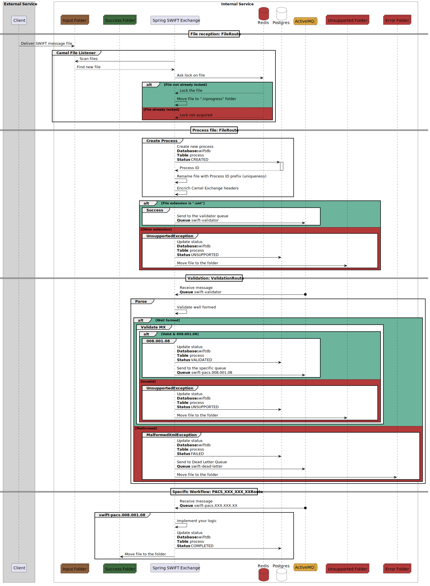

# **Spring SWIFT Exchange**

*A boilerplate Java application for processing incoming and outgoing SWIFT messages in a banking context.*

---
[](https://github.com/Raymice/spring-swift-exchange/actions/workflows/formatting.yml)
[](https://github.com/Raymice/spring-swift-exchange/actions/workflows/test.yml)


---

## **📌 Table of Contents**

- [Technologies Used](#-technologies-used)
- [Requirements](#-requirements)
- [Build Instructions](#-build-instructions)
- [Running the Application](#-running-the-application)
- [Deploy the Application](#-deploy-the-application)
- [External Dependencies](#-external-dependencies)
- [Configuration](#-configuration)
- [Workflow](#-workflow)
- [Performance](#-performance)
- [Scalability](#-scalability)
- [Resilience](#-resilience)
- [Observability](#-observability)
- [Conventions](#-conventions)
- [TODO List](#-todo-list)

---

## **🛠 Technologies Used**

List of all the technologies, frameworks, and tools used in the project.

| Category              | Technologies/Tools                                                                  |
|-----------------------|-------------------------------------------------------------------------------------|
| **Backend**           | Java 25, Spring Boot 4, Spring Data JPA, Apache Camel                               |
| **Database**          | PostgreSQL, Flyway                                                                  |
| **Distributed cache** | Redis                                                                               |
| **Message broker**    | ActiveMQ classic                                                                    |
| **Build Tool**        | Maven                                                                               |
| **Testing**           | JUnit 5, Mockito, Testcontainers                                                    |
| **Logging**           | Logback/Slf4j                                                                       |
| **Containerization**  | Docker, Docker Compose                                                              |
| **CI/CD**             | N/A                                                                                 |
| **Monitoring**        | Prometheus, Grafana, Loki, Tempo                                                    |

---

## **📋 Requirements**

Prerequisites for building and running the application:

- **Java**: JDK 25 or later, GraalVM 25+ (if you plan to build native images)
- **Build Tool**: Maven 3.9.11+
- **Database**: PostgreSQL 17-alpine
- **Distributed cache**: Redis 8.2.2
- **Message broker**: ActiveMQ classic 6.1.7
- **Monitoring**: Grafana-lgtm  0.11.17
- **Docker**: Docker 29.0.3+
- **Environment Variables**:
  - `SPRING_DATASOURCE_USERNAME`
  - `SPRING_DATASOURCE_PASSWORD`

---

## **🔨 Build Instructions**

### 1 - Build for development

```bash
# Build the project
./mvnw clean install -Dmaven.test.skip=true
```

### 2 - Build for production

```bash
# Build the docker image (non native)
./mvnw spring-boot:build-image -Dmaven.test.skip=true
```

---

## **🏃 Running the Application**

How to run the application locally:

### 1 - Create environment file

Create a **.env** file with the required environment variables (see [Configuration](#-configuration))

### 2 - Deploy the dependencies

```bash
# Script command
./scripts/deploy-dependency-stack.sh
```

OR

```bash
# Manual command
docker stack deploy -c docker-compose.yml  stack --detach=true
```

### 3 - Run the application

```bash
# Run the application
./mvnw spring-boot:run -Dspring-boot.run.profiles=dev
```

---

## **🚀 Deploy the Application**

How to deploy the application with Docker:

### Use script (build of app required before)

```bash
./scripts/deploy-full-stack.sh
```

OR

### Use script including the build of the app

```bash
./scripts/build-and-deploy-full-stack.sh
```

OR

### Run manual command (build of app required before)

```bash
docker stack deploy -c docker-compose.yml -c docker-compose.app.yml stack --detach=true
```

---

## **🔗 External Dependencies**

List of all external services that application depends on:

- **Database**: *PostgreSQL* – Stores and manages all process data.
- **Distributed Cache**: *Redis* – Ensures idempotency and manages parallelism for Apache Camel workflows.
- **Message Broker**: *ActiveMQ* – Facilitates the distribution and propagation of processes across the platform.
- **SWIFT Library**: *com.prowidesoftware.pw-iso20022* - Allow parsing and creation of SWIFT messages.

---

## **🧰 Configuration**

How to configure the application:

This project uses Spring profiles to manage different configurations for various environments.
The available profiles are:

- `dev`: Development environment
- `test`: Testing environment
- `prod`: Production environment

### **Application Properties**

Need to setup `application-*.properties` accordingly to your preferences

### **Environment Variables**

Required variables for Postgres

- `SPRING_DATASOURCE_USERNAME`
- `SPRING_DATASOURCE_PASSWORD`

---

## **📊 Workflow**

### Global Workflow



---

## **📈 Performance**

- ✅ Usage of virtual threads (Java 21) to improve concurrency and resource utilization.
- ✅ ActiveMQ handles message queuing and delivery efficiently.
- ✅ Multiple ActiveMQ consumers can be configured to process messages in parallel, enhancing throughput.
- ✅ Usage of Database Stored Procedure & Trigger to fill history table

---

## **🧑‍🤝‍🧑 Scalability**

- ✅ The application is designed to be stateless, allowing for easy scaling and load balancing.
- ✅ Multiple instances of the application can run concurrently to handle increased load.
- ❌ Scalable database architecture using sharding and dynamic partitioning to efficiently manage high data volumes and ensure optimal performance.

---

## **🔄 Resilience**

- ✅ Redis locked operations ensure data consistency across instances.
- ✅ ActiveMQ transaction management
- ✅ Automatic reconnection to external dependencies (Redis, Postgres, ActiveMQ)

---

## **🔭 Observability**

Leverages the Grafana LGTM stack for comprehensive observability:

- **Loki** for centralized log aggregation and management,
- **Grafana** for unified visualization and custom dashboards,
- **Tempo** for distributed tracing,
- **Mimir/Prometheus** for metrics collection and monitoring.

ℹ️ Usage of **spring-boot-starter-opentelemetry** to support observability for Native build.

### Metrics

- Every kind of metrics (database, JVM resources, ...)


- Custom dashboard


### Logs

- Distributed log view


- Filtering of logs by custom MDC property


### Traces

- Trace with custom span attributes


---

## **📝 Conventions**

- Usage of code formatter: [spotless](https://github.com/diffplug/spotless/tree/main/plugin-maven)
- Usage of git hook (see spotless)
- Usage of MDC to bind each log with a context
- Usage of PlantUML for sequence diagrams
- Usage of JaCoCo for code coverage

---

## **✅ TODO List**

- Add explanation of how the application works
- Things to evaluate/change before production
  - Add check on the health of the app (/actuator/health)
  - Need to update properties before usage in production (opentelemetry, security, ...)
- Explain error workflows:
  - Unsupported files
    - Warning log
    - Update status of process in database
    - Output in unsupported folder
  - Retryable error
    - Retry mechanism with backoff
    - If limit is reached, act like non-retryable error
  - Non-retryable error
    - Error log
    - Update status of process in database
    - Output in error folder
    - Dead letter queue
- Explore sharding & partitioning for Postgres (Citrus)
- Review all javadoc
- Add websites references for each topic
- Explain Native build
  - Create dedicated dockerfile for build
- Implement tool for volume testing (Gatling, JMeter)
- Explain technology choices and suggest alternatives
- Add security for specific actuator endpoints ?
- Implement all SWIFT message type
  - Include conversion
- Create a frontend application as dashboard ?
- Speak about configuration of ActiveMq for production
  - node
  - persistence
  - storage

---
